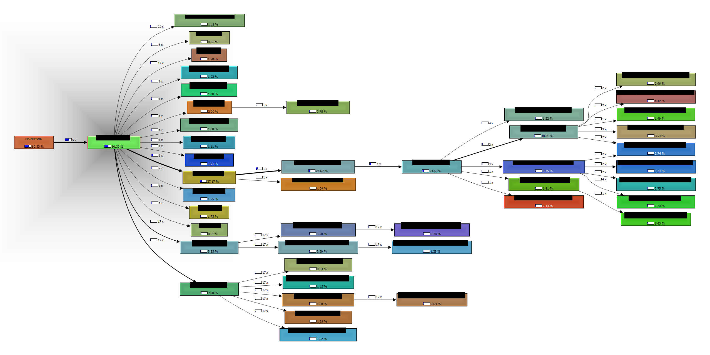

# tc3profiler




The scripts, implemented within the scope of this repository, aim to simple profiling for method calls to TwinCAT PLCs. 
Profiling is restricted to 1 Task and 1 PRG and visualization is implemented via callgrind. http://kcachegrind.sourceforge.net/html/Home.html

The general idea is as follows

1. ProfilerLib is a TwinCAT library that includes a program, which is used for profiling. It includes methods to built-up a callstack and some triggers to start profiling.
2. prepare.py is a python script that is used to add profiling boilerplate code to your PLC.
3. fetch.py can be used to read callstack from the PLC
4. reconstruct.py is used to convert the recorded callstacks to callgrind (http://kcachegrind.sourceforge.net/html/CallgrindFormat.html)

The profile can then be visualized by qcachegrind. What follows is a short instruction how to use the code that is provided in this repository for profiling your PLC.

## Add library

Download *ProfilerLib.compiled-library* and install it in your library repository. Then add *ProfilerLib* as a reference to your PLC.

## Prepare

Next, add the following code to your MAIN program

```
ProfilerLib.Profiler();
(* @@ PROFILER @@ *)ProfilerLib.Profiler.Push(0);(* @@ PROFILER @@ *)

// your implementation comes here

ProfilerLib.Profiler();
(* @@ PROFILER @@ *)ProfilerLib.Profiler.Pop(0);(* @@ PROFILER @@ *)
```

Then use `prepare.py` to add similar code section to all methods of your PLC.

```
python prepare.py -d <PATH_TO_PLC> -a add -o ./
```

The script transverses through the entire code base of the plc located at the given directory. For all methods and it adds a header function call and a footer function call to the profiler library. The method calls are identified by id's and can be converted to readable strings by a hashmap file, which is generated by the script.


## Activate

You can now activate your PLC on your target and work as you are used to, note that the Profiler adds some overhead to your code. making execution a bit slower. Usually
you should not notice a big impact though. To start profiling navigate to your MAIN programm, right click on *Profiler* and `Add Watch`.

Then search for *ProfilerLib.Profiler* in the Watch panel and expand the node. You can use the watch window to
- Capture the callstack of a single frame of your PLC by a rising edge of *CaptureOnce*
- Run Captures continuously by setting *CaptureContinuous=TRUE*. For this setting you can also specify a cpu time threshold such that only
  frames with a certain percentage-based usage of your CPU are captured.
- The library includes a parameter *MAX_FRAMES*, which is used to adjust the maximum amount of recorded frames. If *FrameIndex=MAX_FRAMES* no 
  new captures will be performed by the Profiler. In order to reset already taken recordings you can give a rising edge on *Reset*. This will 
  internally remove all data and set *FrameIndex=0* again.


## Take snapshot

Run the following script to read out all data from your PLC. Note that recording should be disabled before calling this issue. Disable
continous capturing by setting *CaptureContinuous=FALSE*. Then call

```
python fetch.py -n <NETID> -p 851 -d <SNAPSHOT_OUTPUT_DIR>
```

to get all recorded frames and store them in the *SNAPSHOT_OUTPUT_DIR* directory.


## Convert snapshot

Use the following script to reconstruct a frame.

```
python reconstruct.py -m <HASHMAPFILE> -c <CALLSTACK> -d <CALLGRIND_OUTPUT_DIR>
```

Creates a callgrind file in the directory given by the option -d. This script uses a previously generated hashmap (> generate profiling guards) together with a recorded callstack (> make callstack snapshot).

## Cleanup

To cleanup your code from code that was added in the *Prepare* section you can run the *prepare* script as follows

```
python prepare.py -d <PATH_TO_PLC> -a remove
```

The script transverses through the entire code base of the plc located at the given directory. For all methods, the script removes the header function call and a the footer function call to the profiler library that were previously generated by using the "add" command of the script
